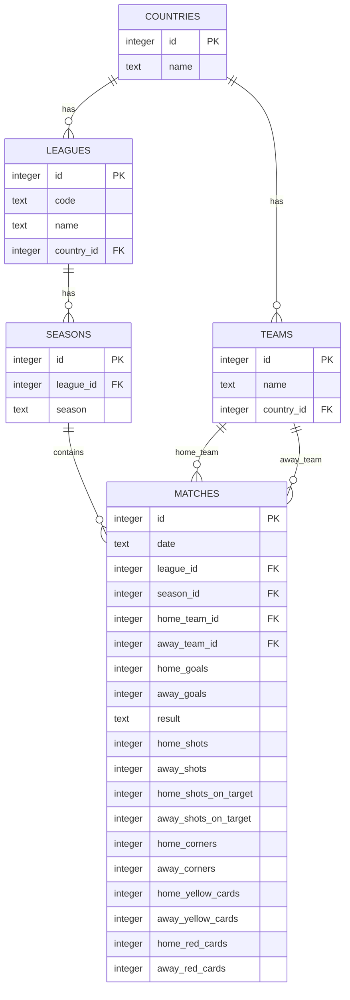
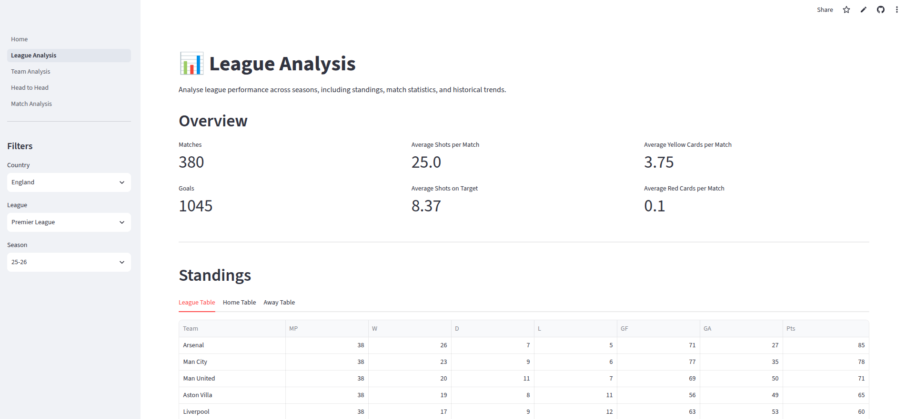
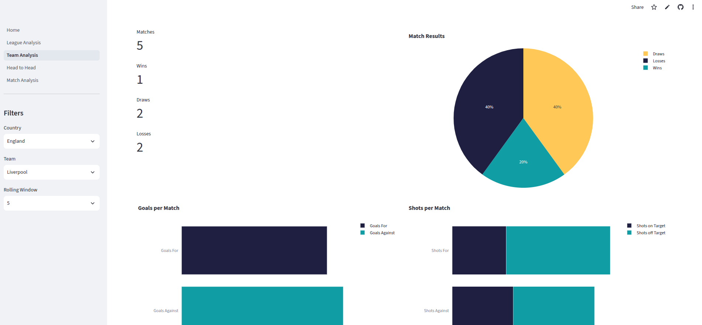
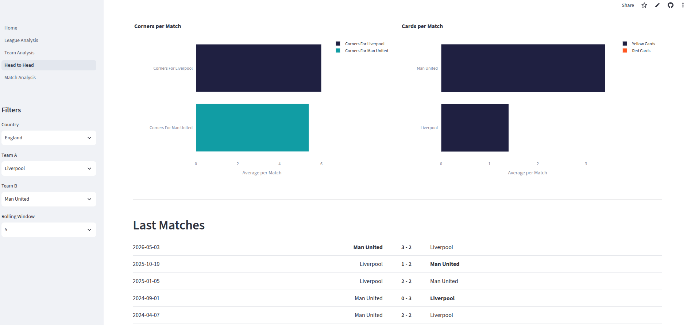
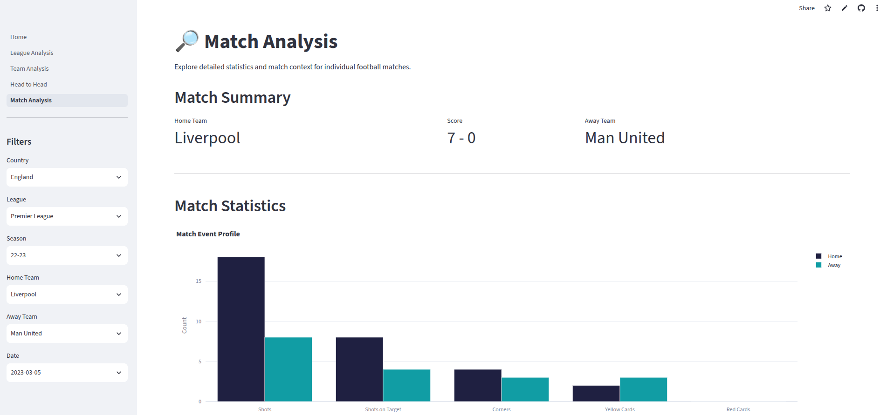

# Football Analytics Dashboard

A compact, end-to-end football analytics project built as a portfolio piece for a Data Science / Data Analytics role. The app combines **Python**, **SQL**, **Pandas**, **Plotly**, and **Streamlit** to turn football match data into an interactive dashboard for league, team, head-to-head, and match-level exploration.

## Highlights

- Explore league performance, standings, and season trends
- Analyze team form, recent results, and match-level metrics
- Compare two teams through head-to-head statistics and historical meetings
- Investigate individual matches with contextual event profiles and form summaries
- Use a SQLite database to power structured, repeatable analysis

## Dashboard Pages

| Page | Purpose |
| --- | --- |
| Home | Project overview and database summary |
| League Analysis | League-level metrics, tables, and historical trends |
| Team Analysis | Team performance, recent form, and match statistics |
| Head-to-Head | Direct comparison between two teams |
| Match Analysis | Detailed analysis of a selected fixture |

## Technologies

- Python
- Streamlit
- SQLite
- Pandas
- Plotly
- SQL
- Git / GitHub for project organization

## Data Source and Database Overview

The project uses football match data sourced from football-data.co.uk in CSV format, which is imported into a local SQLite database. The workflow includes:

1. Downloading raw CSV files
2. Importing them into a relational SQLite schema
3. Querying the database from Streamlit pages

### Database schema

The database includes the following core tables:

- countries
- leagues
- seasons
- teams
- matches

### ER diagram



## Project Structure

```text
Home.py
config/
database/
pages/
scraper/
sql/
data/
requirements.txt
```

- config/: shared plotting and environment settings
- database/: SQLite connection, queries, and import/build scripts
- pages/: Streamlit page modules for each dashboard view
- scraper/: data download utilities
- sql/: schema and SQL inserts
- data/: raw football data and generated SQLite database

## What the Project Demonstrates

This project highlights practical skills in:

- Python scripting and data processing
- SQL/database design and relational joins
- Data cleaning and transformation with Pandas
- Interactive charting with Plotly
- Building a multi-page web dashboard with Streamlit
- Organizing a data product with reusable components and clear project structure

## Installation and Local Run

### Requirements

- Python 3.10+
- pip

### Setup

```bash
git clone <repository-url>
cd football-analytics-dashboard
python3 -m venv .venv
source .venv/bin/activate
pip install -r requirements.txt
```

The repository already includes a ready-to-use SQLite database, so you can start the app directly without downloading data or rebuilding the database.

### Download data

```bash
python3 -m scraper.download_data
```

### Build the database

```bash
python3 -m database.create_database
python3 -m database.build_database
```

### Start the app

```bash
streamlit run Home.py
```

### Update the database

```bash
python3 -m scraper.download_data
python3 -m database.update_database
```

## Example Screenshots

### League Analysis



### Team Analysis



### Head-to-Head



### Match Analysis



## Possible Future Improvements

- Add richer temporal analysis and trend forecasting
- Include player-level or expected goals metrics
- Expand the dataset and supported competitions

## Portfolio Note

This project is intended to showcase a practical, end-to-end analytics workflow: collecting data, structuring it in a database, querying it with SQL, and presenting insights through a polished Streamlit dashboard.
